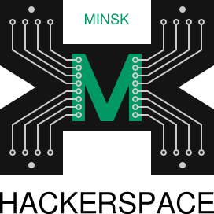
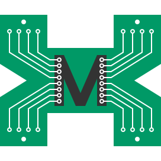
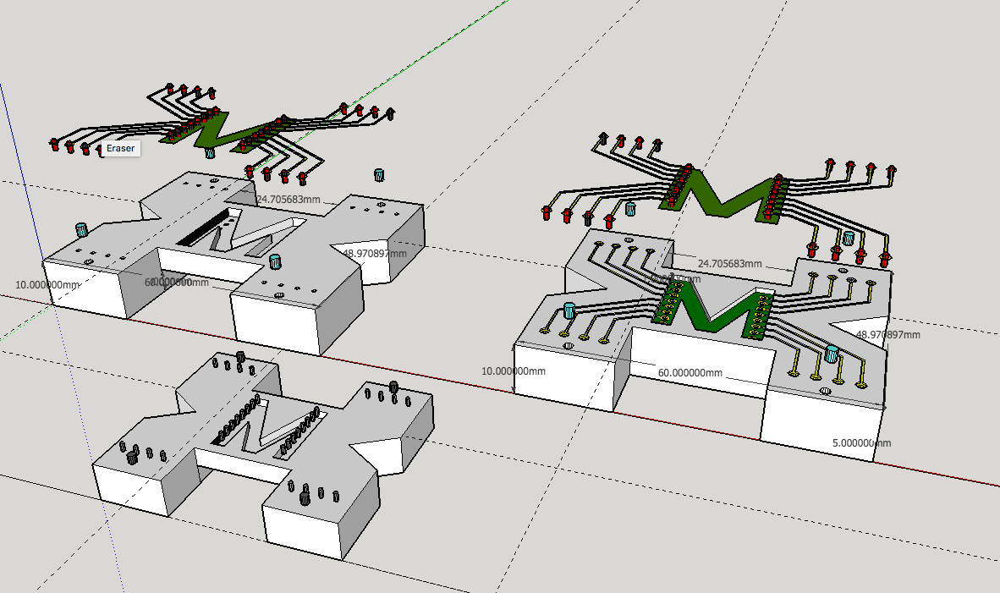

Logos
=========

All logos created for [Minsk Hackerspace](http://hackerspace.by)

## Black logo

[black.eps](black.eps) [black.svg](black.svg)

## Black logo with text

[black_with_text.eps](black_with_text.eps) [black_with_text.svg](black_with_text.svg)

## Green logo

[green.eps](green.eps) [green.svg](green.svg)

## Green logo with text

[green_with_text.cdr](green_with_text.cdr) [green_with_text.svg](green_with_text.svg)

## Breakout logo

[logo_breakout.skp](logo_breakout.skp)

## Old 

[old.svg](old.svg)

License
------------

[Attribution-ShareAlike 4.0 International (CC BY-SA 4.0)](http://creativecommons.org/licenses/by-sa/4.0/)
